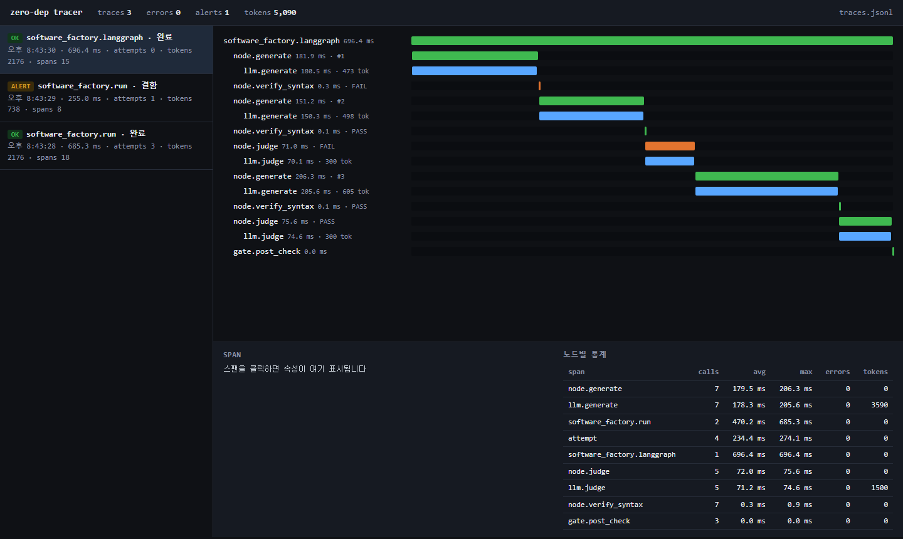
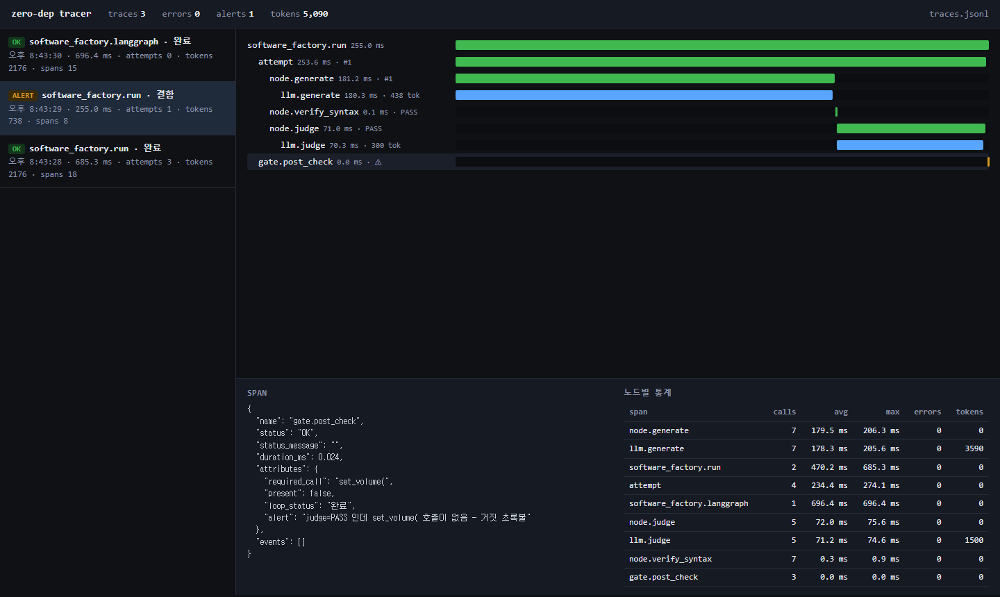

# zero-dep tracer

> LLM 에이전트 루프를 위한 **무의존(stdlib-only) 트레이싱·모니터링** 키트.
> Zero-dependency tracing and a local dashboard for LLM agent loops — runs fully offline, including air-gapped corporate networks.



## 왜 만들었나

폐쇄망 교육장에서는 Langfuse · LangSmith 같은 외부 관측 서비스에 닿지 못하고 Docker 반입도 어렵습니다. 그래도 "AI가 실제로 어떻게 일했는가"를 남기고 보는 **관측(Observability)의 원리**는 가르쳐야 합니다. 이 키트는 파이썬 표준 라이브러리만으로 그 최소 구성을 제공합니다.

- **설치할 것이 없습니다.** Python 3.10+ 이면 `tracer.py` 와 `dashboard.py` 가 그대로 돌아갑니다.
- **스팬 필드명이 OpenTelemetry 와 같습니다.** 망이 열리는 날 같은 JSONL 을 Langfuse / OTel Collector 로 그대로 내보낼 수 있습니다.
- **데모는 Mock LLM 으로 돌아갑니다.** API 키 · 인터넷 없이 실행되고, 키가 있으면 `--real` 로 실제 Claude 를 호출합니다.

이 키트는 Langfuse 의 대체가 아니라 **원리 노출용**입니다. 관측(무엇이 있었나)은 stdlib 로 충분하지만, 평가(데이터셋 회귀 · 실험 비교 · 프롬프트 관리)는 제품이 필요합니다.

## 빠른 시작

**Windows** — 두 파일을 더블클릭하면 끝입니다.

1. `start_dashboard.cmd` → 로컬 서버가 뜨고 브라우저에 http://127.0.0.1:8790 이 열립니다
2. `run_demos.cmd` → 데모 3종이 순서대로 돌고, 대시보드에 트레이스가 2초 간격으로 쌓입니다

**터미널 (Windows / macOS / Linux)**

```bash
python dashboard.py --open          # 대시보드 (다른 터미널에서 계속 켜 둔다)

python demo_loop.py --reset         # 1) 자가 교정 루프 — 3회 만에 성공하는 정상 시나리오
python demo_loop.py --false-green   # 2) 거짓 초록불 — LLM 판정은 PASS, 결정적 게이트가 잡아낸다
python demo_langgraph.py            # 3) 같은 노드를 LangGraph 로 — 관측 코드는 그대로

python -c "from tracer import print_tree; print_tree('traces.jsonl', last=3)"   # 브라우저 없이 터미널 트리로
```

실제 Claude 로 돌리려면 `ANTHROPIC_API_KEY` 를 설정한 뒤 `python demo_loop.py --real` 을 실행합니다 (`pip install anthropic` 필요).

## 데모가 보여주는 것

데모 파이프라인은 코드 생성 팩토리의 뼈대입니다.

```
generate ──▶ verify(ast) ──▶ judge(LLM) ──▶ post_check(결정적 게이트)
    ▲            │ 실패           │ FAIL
    └────────────┴────────────────┘      스텝 예산(MAX_ATTEMPTS) 초과 시 status = 차단
```

| 시나리오 | 종료 상태 | 시도 | 트레이스가 보여준 것 |
|---|---|---|---|
| 정상 (`demo_loop.py`) | `완료` | 3 | 1차 `SyntaxError` → 2차 문법 통과·판정 FAIL(빈 구현) → 3차 PASS. 시도별 입력 토큰이 473 → 498 → 605 로 늘어나는 이유(에러 컨텍스트가 프롬프트에 붙는다)가 눈에 보인다 |
| 거짓 초록불 (`--false-green`) | **`결함`** | 1 | `node.judge` 는 PASS 라고 했지만 `gate.post_check` 가 `set_volume(` 호출 부재를 잡아 `alert` 를 남긴다. **트레이스 없이는 "완료"로 보였을 실행** |
| LangGraph (`demo_langgraph.py`) | `완료` | 3 | 노드 함수와 데코레이터를 그대로 재사용. 프레임워크를 바꿔도 관측 코드는 한 줄도 바뀌지 않는다 |

거짓 초록불 시나리오에서 `gate.post_check` 스팬을 클릭한 화면입니다. `loop_status` 는 `완료`, 판정도 PASS 였지만 `present: false` 와 `alert` 가 같은 스팬에 남아 있습니다.



## 수업에서 전달할 세 문장

1. **trace 하나 = 실행 하나, span 하나 = 작업 하나.** 부모-자식으로 중첩된다. `with tracer.span()` 이 전부다.
2. **무엇을 속성으로 남길지가 관측 설계다.** 이 데모는 `attempt`, `verdict`, `reason`, `llm.input_tokens`, `alert` 다섯 개를 남긴다. 이것으로 "왜 3번 돌았나", "얼마 들었나", "판정을 믿어도 되나"에 답할 수 있다.
3. **실패는 두 종류다.** 멈추지 않는 실패(보인다)와 성공했다고 말하는 실패(안 보인다). 두 번째를 잡으려고 `gate.post_check` 같은 **값싸고 속이기 어려운 검증**을 루프 바깥에 두고, 판정과 어긋나면 `alert` 로 남긴다.

## 내 루프에 붙이기

```python
from tracer import Tracer
tracer = Tracer("traces.jsonl", service="my-agent")

@tracer.traced("node.generate")                 # 함수 하나 = 스팬 하나
def generate(state):
    with tracer.span("llm.generate") as llm:    # LLM 호출은 자식 스팬 — 비용을 따로 본다
        resp = client.messages.create(...)
        llm.record_llm(resp, "claude-sonnet-5")
    ...

with tracer.trace("run", requirement=req) as root:   # 루트 스팬 = 실행 1건 = 새 trace_id
    while state["status"] == "진행중":
        with tracer.span("attempt", attempt=state["attempts"] + 1):
            state.update(generate(state))
            state.update(verify(state))
    root.set(final_status=state["status"])
```

- `Tracer.current()` 로 지금 열려 있는 스팬을 얻어 `sp.set(...)` 으로 속성을 덧붙입니다.
- 예외는 자동으로 `status="ERROR"` + `exception` 이벤트로 기록되고 다시 던져집니다.
- 검증이 실패를 *찾아낸* 것은 검증의 성공입니다. 스팬 `status` 는 OK 로 두고 `verdict="FAIL"` 속성으로 남기는 것을 권합니다 (데모가 그렇게 합니다).

## 개념 대응표

| 이 키트 | OpenTelemetry | Langfuse |
|---|---|---|
| `tracer.trace()` 루트 스팬 | Trace (root span) | Trace |
| `tracer.span()` / `@tracer.traced` | Span | Observation (Span) |
| `llm.*` 스팬 + `record_llm()` | Span with `gen_ai.*` attributes | Generation |
| `attributes.verdict` / `alert` | Span attribute | Score |
| `traces.jsonl` (스팬 1개 = 1줄) | OTLP JSON export | Ingestion API |
| `dashboard.py` 워터폴 | — | Trace detail view |
| `dashboard.py` 노드별 통계 | — | Dashboard / Metrics |
| (없음) | — | Datasets · Experiments · Prompt management |

## 파일 구성

| 파일 | 역할 | 의존성 |
|---|---|---|
| `tracer.py` | 스팬 생성·중첩·JSONL 기록. `@tracer.traced`, `tracer.span()`, `tracer.trace()`, `print_tree()` | **없음** |
| `dashboard.py` | `http.server` 기반 워터폴 · 노드별 통계 · 스팬 속성 뷰어. 외부 JS/CSS/폰트 없음, 2초 자동 갱신 | **없음** |
| `demo_loop.py` | 자가 교정 루프 데모 (Pure Python). Mock LLM 내장, `--real` 로 실제 Claude | `anthropic` (`--real` 만) |
| `demo_langgraph.py` | 같은 노드를 `StateGraph` 로 재조립 | `langgraph` ≥ 1.0 |
| `start_dashboard.cmd` · `run_demos.cmd` | Windows 더블클릭 실행 | — |
| `docs/` | 대시보드 스크린샷 | — |

`dashboard.py [traces.jsonl] [port] [--open]` — 파일과 포트는 선택, 기본값은 스크립트 폴더의 `traces.jsonl` 과 `8790`.

## 한계 (알고 쓰기)

- **단일 프로세스 · 단일 파일.** 스레드 fan-out 은 `contextvars` 가 복사되어 부모 관계가 유지되지만, 멀티프로세스에서는 파일 append 가 섞일 수 있습니다. 1인 1프로세스 실습 규모에서는 문제없습니다.
- **샘플링 · 보존 정책 없음.** `traces.jsonl` 은 계속 자랍니다. `--reset` 으로 비우거나 날짜별로 파일을 나누세요.
- **비용은 토큰까지.** 단가는 모델·시점마다 달라 넣지 않았습니다. `llm.input_tokens` / `llm.output_tokens` 에 단가를 곱해 통계에 열 하나 추가하면 됩니다.
- **`--real` 경로는 표준 anthropic SDK 호출 한 곳**(`RealLLM.create`)입니다. 데모 검증은 Mock 으로 수행했습니다.

검증 환경: Python 3.13 · LangGraph 1.0.8 · Windows 11 · 2026-09.
